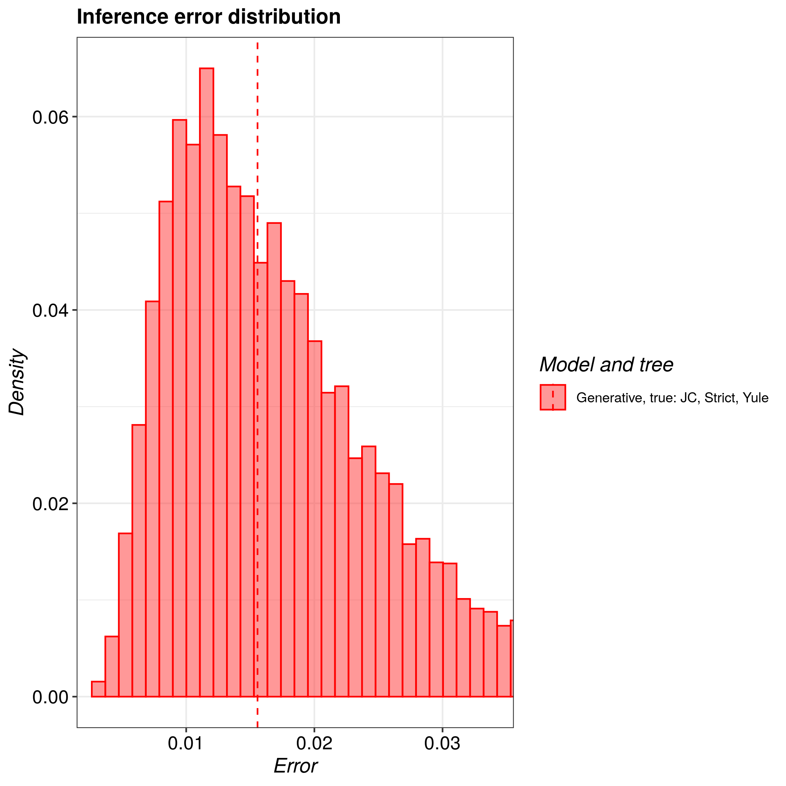
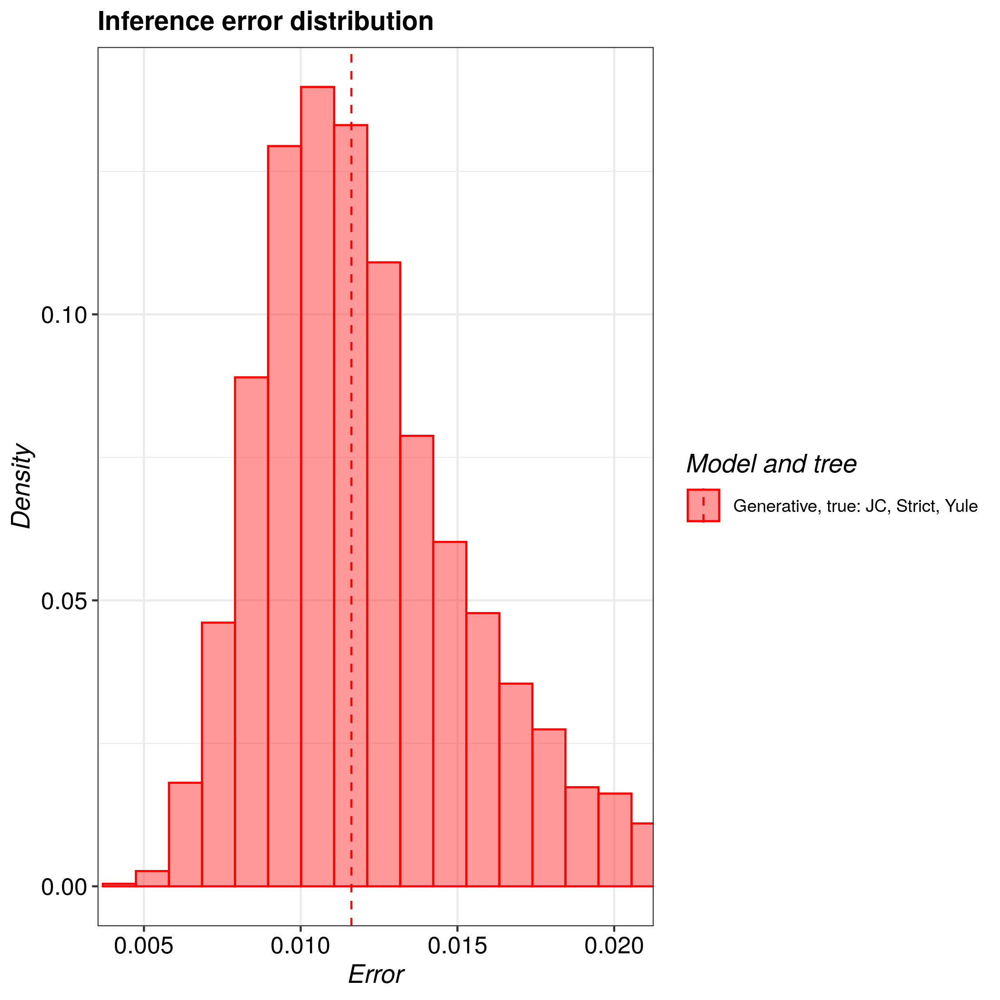
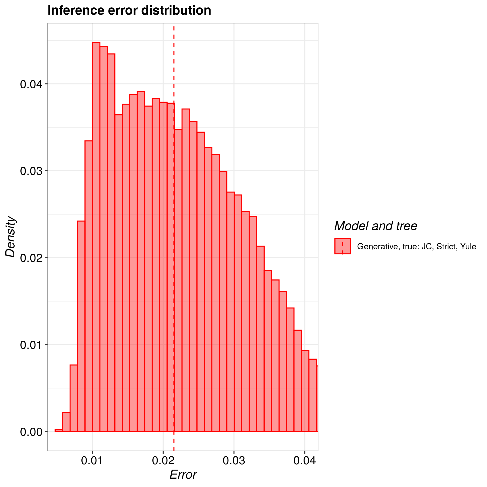
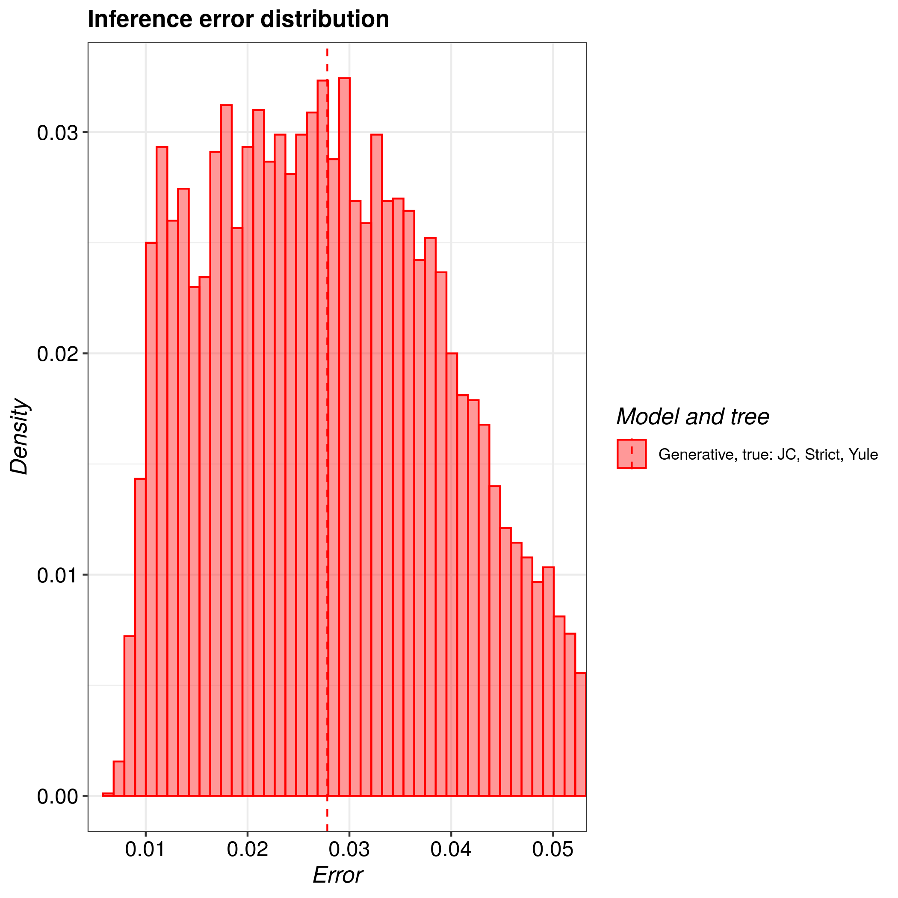

# pirouette_example_20

Branch   |                                                                                                 |                                                                                               
---------|--------------------------------------------------------------------------------------------------------------------------------------------------------------|--------------------------------------------------------------------------------------------------------------------------------------------------------------------------------------------
`master` | |?
`develop`||?

A [pirouette example](https://github.com/richelbilderbeek/pirouette_examples)
that shows the true and twin error distribution for an increasing number of taxa.

## Results

10 taxa:

20 taxa:

30 taxa:

40 taxa:

